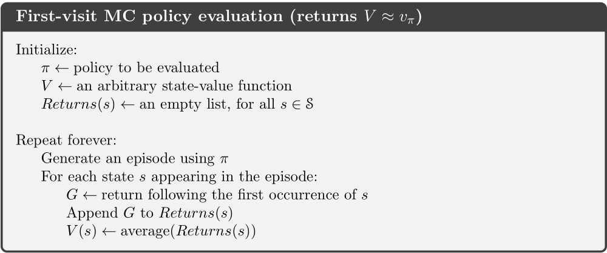
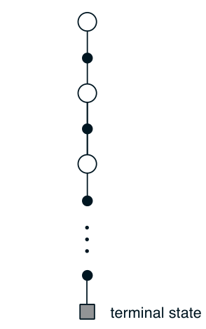
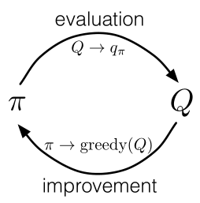

蒙特卡洛方法(Monte Carlo method)是通过采样，用某个随机事件出现的频率估计该随机事件的概率、随机变量的期望的方法。本文将介绍在强化学习中利用蒙特卡洛方法估计行动价值$q_\pi(s,a)$(预测问题)、更新策略(控制问题)。

<!--more-->

## 预测问题 Monte Carlo Prediction

### 基本方法

预测问题的目标是，在给定一个策略$\pi$后，计算行动价值函数$q_\pi(s,a)$。根据定义，行动价值函数是在给定的状态s、行动a下，累计回报G的期望：

$$
q_\pi(s,a)=\mathbb{E_\pi}[G_t \mid S_t=s,A_t=a]
$$

其中累计回报G是从当前时刻开始，折现回报之和：

$$
G_{t}=R_{t+1}+\gamma R_{t+2}+\gamma^{2} R_{t+3}+\cdots=\sum_{k=0}^{\infty} \gamma^{k} R_{t+k+1}
$$

使用蒙特卡洛方法，是将行动价值计算公式中，累计回报G的数学期望，替换成采样累计回报G的平均值：

$$
q_{\pi}(s,a) \approx \frac{1}{n} \sum_{i=1}^{n} G_{i}
$$

其中采样时采用策略$\pi$，生成一系列观测片段，就能保证是在$\pi$产生的分布下计算的期望。例如我们得到一个观测片段$
S_{1}, A_{1}, R_{2}, \ldots, S_{t}=s, A_{t}=a, R_{t+1}, \ldots, S_{T}, A_{T}, R_{T+1}
$,得到累计回报G的一个采样：

$$
G_{i}=R_{t+1}+\gamma R_{t+2}+\cdots+\gamma^{T-t} R_{T+1}
$$

多次采样后，得到针对(s,a)的一系列累计回报$G_1,G_2,\cdots,G_n$，取均值就得到$q_{\pi}(s,a)$的一个估计。

### 首次访问MC和每次访问MC

首次访问和每次访问是针对一个episode而言的。在一个episode中，同一个(s,a)可能多次被访问到，其中第一次访问(s,a)称为首次访问，因而有如下区别：

- 首次访问MC算法：用首次访问的累计回报G估计动作价值$q_\pi(s,a)$；
- 每次访问MC算法：用所以访问的累计回报G估计动作价值$q_\pi(s,a)$。

### 回溯图backup diagram

## 控制问题

### 基本方法

控制问题的目标是求解最优策略。基本思想是广义策略迭代(GPI)：当前价值函数不断迭代近似当前策略的真实价值函数(策略评估)，当前策略根据当前策略不断调优(策略改进)。

### 策略改进

对于每个状态s，策略改进的贪心策略为选择动作价值函数最大的动作：

$$
\pi(s) \triangleq \mathop{\arg\max}\limits_{a}q(s,a)
$$

下面说明这样的改进能使策略变优。假设$q_{\pi _k}(s,a)$是策略$\pi _k$评估出的动作价值，那么改进后的策略$\pi _{k+1}$为$q_{\pi _k}(s,a)$对应的贪心策略，对任意的状态s：

$$
\begin{aligned}
q_{\pi_{k}}\left(s, \pi_{k+1}(s)\right) &=q_{\pi_{k}}\left(s, \underset{a}{\arg \max } q_{\pi_{k}}(s, a)\right) \\
&=\max _{a} q_{\pi_{k}}(s, a) \\
& \geq q_{\pi_{k}}\left(s, \pi_{k}(s)\right) \\
& \geq v_{\pi_{k}}(s)
\end{aligned}
$$

第一、二个等号是根据贪心策略的定义，第三个不等号是根据最大值的放缩，最后一个不等号我不理解为什么成立，我可以理解的是：
$$
\underset{a}{\max } q_{\pi_{k}}(s, a) \geq \underset{a} \sum \pi{_k}(a \mid s) q_\pi{_k}(s,a) = v_{\pi_{k}}(s)
$$

 

